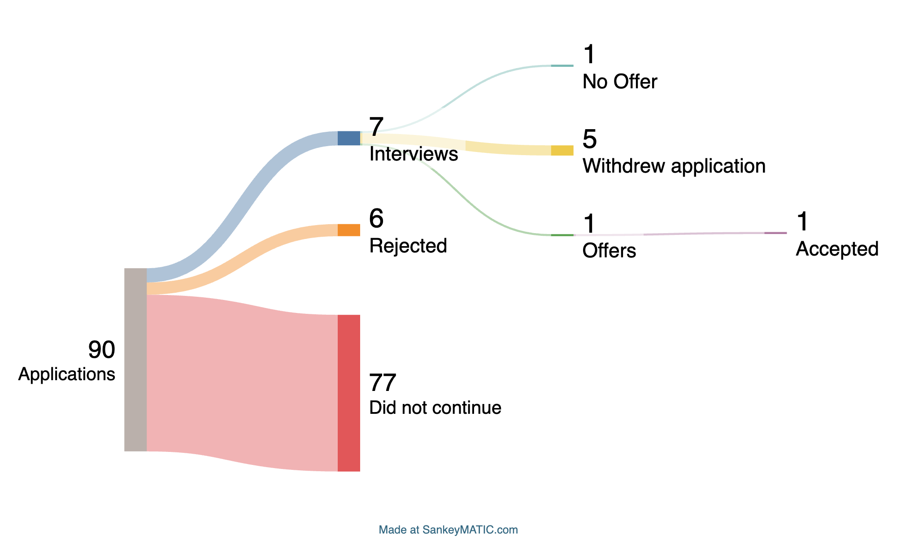

# Co-op Job Applier

An automated tool for Northeastern University students to scrape co-op opportunities from NUWorks and intelligently score them using OpenAI's GPT-4 model. The tool filters jobs based on your qualifications and interests, helping you focus on the most relevant opportunities.

Results: [Reddit Post](https://www.reddit.com/r/NEU/comments/1oe1ppl/spring_coop_search_results_second_year_cs_x/)\



## Features

- **Automated Job Scraping**: Fetches co-op listings from NUWorks using authenticated API calls
- **AI-Powered Job Scoring**: Uses OpenAI GPT-4 to score jobs from 0-100 based on your profile
- **Smart Filtering**: Automatically filters jobs above your specified score threshold
- **URL Generation**: Creates direct links to promising job postings
- **Comprehensive Logging**: Tracks all operations with detailed logs
- **JSON Output**: Saves both raw job data and filtered results for analysis
- **Automatic Favoriting**: Automatically adds jobs to your favorites list

## Prerequisites

- Python 3.7+
- Valid Northeastern University NUWorks account
- OpenAI API key

## Installation

Video for setting up settings and .env file: https://youtu.be/b3cYAhksQQc

1. Clone the repository:
```bash
git clone https://github.com/Ashwin-Iyer1/NUWorks-Co-op-grader.git
cd NUWorks-Co-op-grader
```

2. Install required dependencies:
```bash
pip install -r requirements.txt
```

3. Set up environment variables by creating a `.env` file:
```env
OPENAI_API_KEY=your_openai_api_key_here
NUWORKS_COOKIE="your_nuworks_cookie_here"
```

## Configuration

### Getting Your NUWorks Cookie

1. Log into NUWorks in your browser
2. Open Developer Tools (F12)
3. Go to the Network tab
4. Refresh the page
5. Find any request to `northeastern-csm.symplicity.com`
6. Copy the entire `Cookie` header value
7. Add it to your `.env` file

### Customizing Your Profile

Edit the `_build_user_context()` method in [`fetchOpenAi.py`](fetchOpenAi.py) to match your:
- Academic year and major
- GPA and coursework
- Technical skills
- Work experience
- Career interests

## Usage

Run the main script:
```bash
python main.py
```

The tool will:
1. Fetch jobs from NUWorks API
2. Save raw data to `response.json`
3. Score each job using OpenAI
4. Filter jobs with scores ≥ 50
5. Save filtered results to `goodJobs.json`
6. Generate clickable URLs for each qualifying job

## Output Files

- **`response.json`**: Raw job data from NUWorks API
- **`goodJobs.json`**: Filtered jobs with scores and direct URLs
- **`job_scraper.log`**: Detailed execution logs

## Scoring System

Jobs are scored 0-100 based on:
- **0**: Not qualified for the position
- **25**: Qualified but not in area of interest
- **50**: Qualified and somewhat relevant
- **100**: Perfect match - qualified and highly relevant

## Job Search Parameters

The tool searches for co-ops in these industries:
- Finance and Banking
- Technology and Software
- Consulting
- Data Science and Analytics

Default filters:
- Job type: Co-op (5)
- Posted within: Last 7 days
- Results per page: 100

## Customization

### Changing Score Threshold
Modify the `min_score` parameter in `main.py`:
```python
good_jobs = scraper.process_jobs(jobs_data, min_score=75)  # Higher threshold
```

### Adjusting Search Filters
Edit the `params` dictionary in the `JobScraper` class to modify:
- Industries
- Job types
- Date ranges
- Result limits

### Modifying AI Scoring
Update the system prompt in `_build_system_prompt()` to change how jobs are evaluated.

## Error Handling

The tool includes comprehensive error handling for:
- Network connectivity issues
- API authentication failures
- JSON parsing errors
- OpenAI API rate limits
- Invalid job data

All errors are logged to `job_scraper.log` for debugging.

## Security Notes

- Never commit your `.env` file or API keys to version control
- Regularly rotate your NUWorks session cookies
- Monitor your OpenAI API usage to avoid unexpected charges

## Requirements

See [`requirements.txt`](requirements.txt) for full dependency list:
- `openai>=2.0.0`
- `python-dotenv>=1.1.1`
- `requests>=2.32.5`

## Contributing

1. Fork the repository
2. Create a feature branch
3. Make your changes
4. Add tests if applicable
5. Submit a pull request

## License

This project is for educational purposes. Please respect NUWorks' terms of service and use responsibly.

## Troubleshooting

### Common Issues

**"NUWORKS_COOKIE environment variable is required"**
- Ensure your `.env` file exists and contains the cookie

**"Failed to fetch jobs"**
- Check if your NUWorks session is still valid
- Verify network connectivity
- Ensure cookie format is correct

**"Invalid score received"**
- Check OpenAI API key validity
- Verify API quota isn't exceeded
- Review job description content for parsing issues

### Debugging

Enable debug logging by modifying the logging level in `main.py`:
```python
logging.basicConfig(level=logging.DEBUG)
```

## Disclaimer

This tool is designed to help students find relevant co-op opportunities more efficiently. Always review job postings manually before applying and ensure you meet all application requirements.
